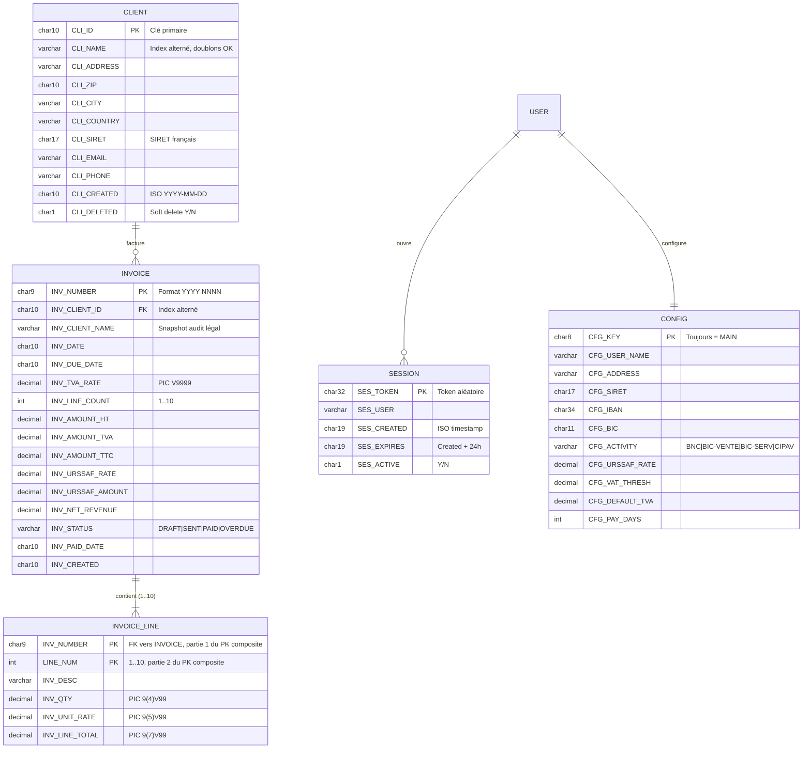

# Conception de la base de données

## Le moteur : ISAM (Indexed Sequential Access Method)

Pas de PostgreSQL, pas de MySQL, pas de SQLite. Le stockage est assuré par **ISAM**, le système de fichiers indexés natif de COBOL. Technologie IBM 1966, encore exploitée en production dans les systèmes bancaires et assurantiels.

ISAM offre les propriétés essentielles d'un SGBD :

| Propriété SGBD | Implémentation ISAM |
|---|---|
| Schéma typé | Copybooks COBOL (`PIC X(50)`, `PIC 9(7)V99`...) |
| Clé primaire | `RECORD KEY IS CLI-ID` |
| Index secondaires | `ALTERNATE RECORD KEY IS CLI-NAME WITH DUPLICATES` |
| Accès indexé O(log n) | B-tree implicite sur le runtime GnuCOBOL |
| Lecture séquentielle ordonnée | `START` + `READ NEXT` sur clé primaire ou alternée |
| Intégrité atomique | Statut de fichier `WS-FILE-STATUS` après chaque opération |

Ce que ISAM **n'offre pas** (et qui guide les choix de design ci-dessous) :

- Pas de langage déclaratif (pas de `JOIN`, pas de `WHERE` complexe)
- Pas de transactions ACID multi-fichiers
- Pas de `FOREIGN KEY` enforced par le moteur

Compensées par dénormalisation contrôlée et discipline applicative — détails plus bas.

---

## Diagramme entité-relation (ERD)



Note : `USER` est une entité conceptuelle. La v1 mono-utilisateur ne stocke qu'un compte `admin` lu depuis l'environnement (`/etc/cobill/cobill.env`). La v1.2 introduira une table `users` avec hash bcrypt — voir [docs/14-roadmap.md](14-roadmap.md).

---

## Entités

### CLIENT — `data/clients.dat`

Annuaire de l'auto-entrepreneur. Soft delete pour préserver l'intégrité des factures historiques.

**Copybook COBOL** (`src/cobol/copybooks/client-record.cpy`) :

```cobol
01  CLIENT-RECORD.
    05  CLI-ID            PIC X(10).
    05  CLI-NAME          PIC X(50).
    05  CLI-ADDRESS       PIC X(80).
    05  CLI-ZIP           PIC X(10).
    05  CLI-CITY          PIC X(40).
    05  CLI-COUNTRY       PIC X(30).
    05  CLI-SIRET         PIC X(17).
    05  CLI-EMAIL         PIC X(60).
    05  CLI-PHONE         PIC X(20).
    05  CLI-CREATED       PIC X(10).
    05  CLI-DELETED       PIC X.
```

**Déclaration ISAM** (`src/cobol/client.cob`) :

```cobol
SELECT CLIENT-FILE
    ASSIGN TO "data/clients.dat"
    ORGANIZATION IS INDEXED
    ACCESS MODE IS DYNAMIC
    RECORD KEY IS CLI-ID
    ALTERNATE RECORD KEY IS CLI-NAME
        WITH DUPLICATES
    FILE STATUS IS WS-FILE-STATUS.
```

**Index** :
- Primaire : `CLI-ID` (unique, format `CLI-XXXXXX`)
- Alterné : `CLI-NAME` avec doublons (recherche par nom)

---

### INVOICE — `data/invoices.dat`

Cœur métier. Une facture = un en-tête + 1 à 10 lignes. Le numéro `YYYY-NNNN` est généré séquentiellement.

**Copybook** (`src/cobol/copybooks/invoice-record.cpy`) :

```cobol
01  INVOICE-RECORD.
    05  INV-NUMBER          PIC X(9).      *> YYYY-NNNN
    05  INV-CLIENT-ID       PIC X(10).
    05  INV-CLIENT-NAME     PIC X(50).     *> Snapshot audit
    05  INV-DATE            PIC X(10).
    05  INV-DUE-DATE        PIC X(10).
    05  INV-TVA-RATE        PIC V9999.
    05  INV-LINE-COUNT      PIC 99.
    05  INV-LINES OCCURS 10 TIMES.
        10  INV-DESC        PIC X(50).
        10  INV-QTY         PIC 9(4)V99.
        10  INV-UNIT-RATE   PIC 9(5)V99.
        10  INV-LINE-TOTAL  PIC 9(7)V99.
    05  INV-AMOUNT-HT       PIC 9(7)V99.
    05  INV-AMOUNT-TVA      PIC 9(7)V99.
    05  INV-AMOUNT-TTC      PIC 9(7)V99.
    05  INV-URSSAF-RATE     PIC V9999.
    05  INV-URSSAF-AMOUNT   PIC 9(7)V99.
    05  INV-NET-REVENUE     PIC 9(7)V99.
    05  INV-STATUS          PIC X(8).      *> DRAFT|SENT|PAID|OVERDUE
    05  INV-PAID-DATE       PIC X(10).
    05  INV-CREATED         PIC X(10).
```

**Déclaration ISAM** :

```cobol
SELECT INVOICE-FILE
    ASSIGN TO "data/invoices.dat"
    ORGANIZATION IS INDEXED
    ACCESS MODE IS DYNAMIC
    RECORD KEY IS INV-NUMBER
    ALTERNATE RECORD KEY IS INV-CLIENT-ID
        WITH DUPLICATES
    FILE STATUS IS WS-INV-STATUS.
```

**Index** :
- Primaire : `INV-NUMBER` (unique)
- Alterné : `INV-CLIENT-ID` avec doublons (toutes les factures d'un client)

**Workflow d'état** :

```
DRAFT → SENT → PAID
         ↓
       OVERDUE  (calculé au rendu si DUE-DATE < today, jamais stocké)
```

---

### SESSION — `data/sessions.dat`

Token d'authentification. Cookie `COBILL_SID` HttpOnly + SameSite=Lax, durée 24 h.

```cobol
01  SESSION-RECORD.
    05  SES-TOKEN         PIC X(32).      *> Hex random
    05  SES-USER          PIC X(30).
    05  SES-CREATED       PIC X(19).      *> ISO timestamp
    05  SES-EXPIRES       PIC X(19).
    05  SES-ACTIVE        PIC X.          *> Y/N
```

**Index** : Primaire sur `SES-TOKEN`. Pas de clé alternée (lookup uniquement par token cookie).

---

### CONFIG — `data/config.dat`

Singleton (un seul enregistrement, clé `MAIN`). Identité de l'auto-entrepreneur, paramètres URSSAF/TVA, IBAN imprimé sur les factures.

```cobol
01  CONFIG-RECORD.
    05  CFG-KEY           PIC X(8).       *> Always "MAIN"
    05  CFG-USER-NAME     PIC X(50).
    05  CFG-ADDRESS       PIC X(80).
    05  CFG-SIRET         PIC X(17).
    05  CFG-IBAN          PIC X(34).
    05  CFG-BIC           PIC X(11).
    05  CFG-ACTIVITY      PIC X(20).      *> BNC|BIC-VENTE|BIC-SERV|CIPAV
    05  CFG-URSSAF-RATE   PIC V9999.
    05  CFG-VAT-THRESH    PIC 9(7)V99.
    05  CFG-DEFAULT-TVA   PIC V9999.
    05  CFG-PAY-DAYS      PIC 999.
```

---

## Correspondance ISAM ↔ SQL

| Opération SQL | Équivalent COBOL |
|---|---|
| `INSERT INTO clients VALUES (...)` | `WRITE CLIENT-RECORD` |
| `SELECT * FROM clients WHERE cli_id = ?` | `MOVE id TO CLI-ID` + `READ CLIENT-FILE KEY IS CLI-ID` |
| `UPDATE clients SET ... WHERE cli_id = ?` | `READ` + modif champs + `REWRITE CLIENT-RECORD` |
| `DELETE FROM clients WHERE cli_id = ?` | Soft : `MOVE 'Y' TO CLI-DELETED` + `REWRITE` |
| `SELECT * FROM clients ORDER BY cli_name` | `MOVE LOW-VALUES TO CLI-NAME` + `START CLIENT-FILE KEY IS CLI-NAME` + boucle `READ NEXT` |
| `SELECT * FROM invoices WHERE inv_client_id = ?` | `MOVE id TO INV-CLIENT-ID` + `START INVOICE-FILE KEY IS INV-CLIENT-ID` + boucle |
| `SELECT * FROM invoices WHERE inv_status = 'OVERDUE'` | Scan séquentiel + filtre applicatif (pas d'index sur status) |

L'équivalent SQL complet est documenté dans [`Cobill/docs/schema.sql`](../Cobill/docs/schema.sql).

---

## Choix de design défendables

### 1. Dénormalisation : `INV-CLIENT-NAME` dupliqué dans la facture

La facture stocke à la fois `INV-CLIENT-ID` (FK logique vers `CLIENT`) et `INV-CLIENT-NAME` (copie textuelle). Exigence légale : une facture émise est immuable. Si le client change de raison sociale en 2027, la facture 2026 doit conserver le nom imprimé en 2026. C'est l'équivalent d'une colonne `*_at_time_of_purchase` côté e-commerce.

### 2. Lignes de facture en `OCCURS 10 TIMES` (non-1NF)

Les 10 lignes sont incluses dans le record `INVOICE` (`OCCURS 10 TIMES`) au lieu d'une table séparée. Lecture en une seule opération disque (pas de `JOIN` SQL), cohérence atomique implicite, limite haute connue et acceptable pour le profil d'usage. Violation 1NF assumée. Le `schema.sql` documentaire propose la version normalisée pour une migration éventuelle.

### 3. Statut `OVERDUE` calculé, jamais stocké

Aucune ligne `INV-STATUS = 'OVERDUE'` n'est écrite en BDD. Le statut est dérivé au rendu :

```cobol
IF INV-STATUS = 'SENT' AND INV-DUE-DATE < TODAY
    MOVE 'OVERDUE' TO DISPLAY-STATUS
END-IF
```

Élimine le besoin d'un cron de mise à jour quotidien et le risque de désynchronisation associé.

### 4. Soft delete sur clients, hard transitions sur factures

- Clients : `CLI-DELETED = 'Y'` (jamais supprimés physiquement)
- Factures : transitions dures (`DRAFT` → `SENT` → `PAID`)

Un client peut disparaître sans casser l'historique des factures émises (FK logique préservée). Une facture, elle, franchit des états bien définis (juridiquement, une facture émise n'est pas effaçable).

### 5. Configuration en singleton (clé fixe `MAIN`)

Un seul enregistrement dans `config.dat`, clé `MAIN`. Version mono-utilisateur ; la v1.2 multi-tenant remplacera par `config_per_user(user_id PK, ...)`.

---

## Limitations & mitigations

| Limitation ISAM | Impact | Mitigation actuelle | Mitigation roadmap |
|---|---|---|---|
| Pas de `JOIN` natif | Liste factures + nom client = 2 lectures (invoice puis client) | Snapshot `INV-CLIENT-NAME` évite la 2ᵉ lecture | OK en l'état |
| Pas de `FOREIGN KEY` enforced | Risque théorique de facture orpheline | Soft delete clients + validation applicative au `WRITE` | Validation supplémentaire à `WRITE` |
| Pas de transactions multi-fichiers | Un crash entre `WRITE INVOICE` et `WRITE INVOICE-AUDIT` peut désynchroniser | Pas d'audit-log séparé en v1 | v1.2 : journal append-only |
| Auto-numbering O(n) non-atomique | Burst concurrent → collision possible sur `INV-NUMBER` | OK solo (1 user) | v1.2 : lock advisory ou compteur dédié |
| Pas de full-text search | Recherche client par nom partiel = scan + filtre | Index alterné `CLI-NAME` (préfixe) | Recherche élargie post-v1 |

---

## Sécurité des données

| Risque | Mitigation |
|---|---|
| Lecture non autorisée | Fichiers `data/*.dat` en `chmod 660` owné `cobill:cobill`, lisible par `www-data` uniquement |
| Path traversal | Aucune entrée utilisateur ne construit un nom de fichier (les `INV-NUMBER` sont générés serveur) |
| Injection | Pas de SQL → pas de SQLi. Les clés ISAM sont typées (`PIC X(10)` tronque au-delà) |
| Hijack de session | Token 32 hex aléatoire, HttpOnly + SameSite=Lax, expiration 24 h vérifiée à chaque requête |
| Backup | À implémenter : `tar czf` quotidien de `data/` vers S3 Glacier (roadmap) |

---

## Volumétrie cible

| Entité | Estimation v1 | Estimation v2 (SaaS) |
|---|---|---|
| `CLIENT` | < 200 / user | 100 000 (multi-tenant) |
| `INVOICE` | < 500 / user / an | 1 M / an |
| `SESSION` | < 10 actives / user | 100 K actives |
| `CONFIG` | 1 (singleton) | 1 / tenant |

ISAM tient sans difficulté la v1 sur un `t3.micro`. La v2 SaaS déclenchera une migration vers PostgreSQL (avec moteur de calcul COBOL conservé via OCESQL ou via API binaire).

---

## Voir aussi

- [`Cobill/docs/schema.sql`](../Cobill/docs/schema.sql) — DDL SQL équivalent
- [`docs/04-architecture.md`](04-architecture.md) — flux CGI → COBOL → ISAM
- [`docs/14-roadmap.md`](14-roadmap.md) — migration vers SQLite/PostgreSQL en v1.2/v2.0
