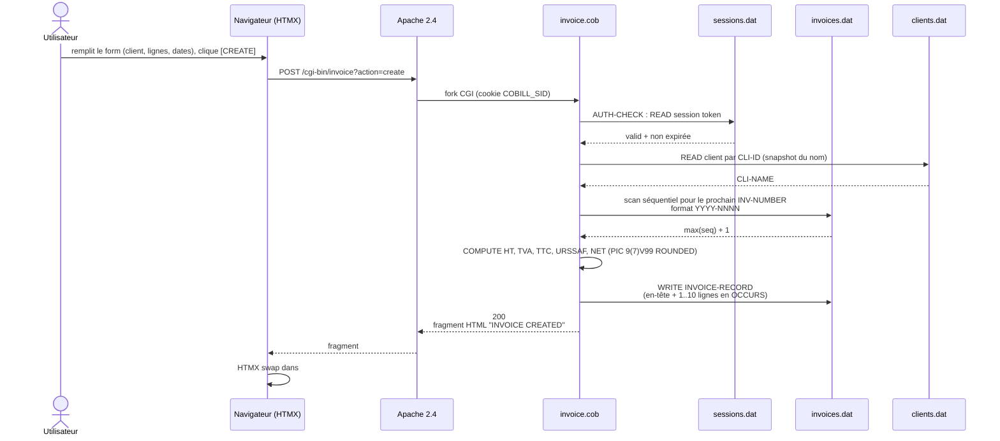
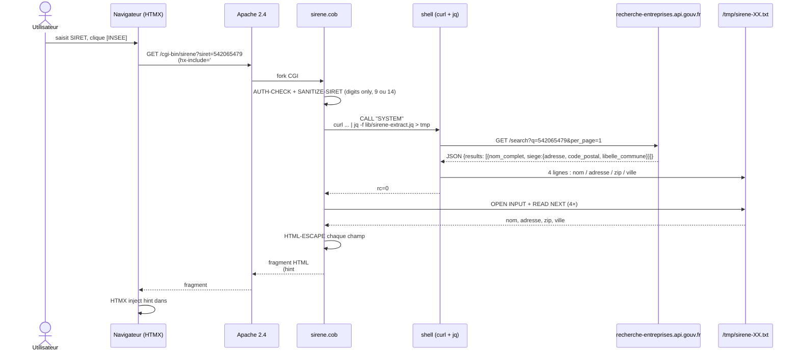

# Diagrammes de séquence

Trois flows critiques de l'application, du clic utilisateur jusqu'à la réponse HTTP. Format Mermaid (rendu natif sur GitHub).

## 1. Login (mode HASH, sha512crypt)

```mermaid
sequenceDiagram
    actor U as Utilisateur
    participant B as Navigateur
    participant A as Apache 2.4
    participant C as auth.cob
    participant E as /etc/cobill/cobill.env
    participant L as libcrypt (crypt(3))
    participant S as sessions.dat (ISAM)

    U->>B: saisit admin + password, clique [LOGIN]
    B->>A: POST /cgi-bin/auth?action=login<br/>body: username=admin&password=...
    A->>C: fork CGI<br/>PassEnv COBILL_AUTH_HASH
    C->>C: PARSE-CGI-INPUT
    C->>E: ACCEPT FROM ENVIRONMENT "COBILL_AUTH_HASH"
    E-->>C: $6$salt$hash...
    C->>L: CALL "crypt" (submitted, stored_hash)
    L-->>C: hash recalculé
    C->>C: comparaison byte-à-byte
    alt match
        C->>C: GENERATE-TOKEN (32 hex)
        C->>S: WRITE SESSION-RECORD (token, +24h)
        C-->>A: 302 Found<br/>Set-Cookie: COBILL_SID=...; HttpOnly
        A-->>B: 302 Location: /app.html
        B->>A: GET /app.html
        A-->>B: app shell (HTML statique)
    else no match
        C-->>A: 401 Unauthorized
        A-->>B: 401 + LOGIN FAILED
    end
```

## 2. Création de facture



## 3. Enrichissement client via API SIRENE



## Notes de lecture

- Tous les binaires COBOL passent par le copybook `auth-check.cpy` (gate en début de programme), sauf `auth.cob` lui-même et `hello.cob`.
- `invoices.dat` et `clients.dat` sont des fichiers ISAM avec clés primaires + alternées — détails dans [`15-database-design.md`](15-database-design.md).
- L'API SIRENE (DINUM) est appelée sans clé d'authentification : seul le SIRET (que l'utilisateur a déjà saisi) sort du serveur.
- Toutes les sorties HTML passent par `HTML-ESCAPE` du copybook `cgi-utils-procs.cpy` pour neutraliser le risque XSS.
